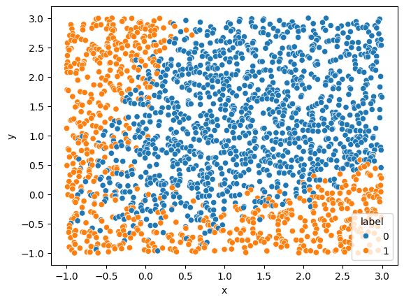

# Ridge challenge

Classifying the following dataset using Ridge Regression. Solution can be found in `challenge-sol.ipynb`. Data generation process can be found in `challenge-gen.ipynb`. `data` contains `foo-train.csv` and `foo-test.csv`.

## Data

## Reference solution

|              |   precision |   recall |   f1-score |    support |
|:-------------|------------:|---------:|-----------:|-----------:|
| 0            |    0.927835 | 0.954907 |   0.941176 | 377        |
| 1            |    0.915842 | 0.868545 |   0.891566 | 213        |
| accuracy     |    0.923729 | 0.923729 |   0.923729 |   0.923729 |
| macro avg    |    0.921838 | 0.911726 |   0.916371 | 590        |
| weighted avg |    0.923505 | 0.923729 |   0.923266 | 590        |